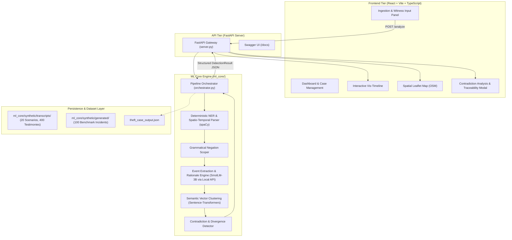

# Silent Witness — Multi-Witness Testimony Consistency Reconstructor

[](https://www.python.org/)
[](https://fastapi.tiangolo.com/)
[](https://react.dev/)
[](https://vitejs.dev/)
[](https://spacy.io/)
[](https://www.sbert.net/)
[](https://huggingface.co/HuggingFaceTB/SmolLM-3B)
[](https://github.com/Harshitmishra001/Capstone_P1/actions)
[](LICENSE)

> **Silent Witness** is an AI-powered forensic consistency engine that ingests unstructured eyewitness testimonies, extracts factual claims (entities, timestamps, locations, and actions), clusters them semantically, and automatically flags where accounts **corroborate** or **contradict** one another — strictly without ever adjudicating truth or labeling witnesses as dishonest.

---

## Table of Contents
1. [Executive Summary & Problem Statement](#1-executive-summary--problem-statement)
2. [Core Principles & Design Philosophy](#2-core-principles--design-philosophy)
3. [System Architecture](#3-system-architecture)
4. [The ML & NLP Pipeline](#4-the-ml--nlp-pipeline)
5. [Real-World Demo: 5-Witness Jewelry Heist](#5-real-world-demo-5-witness-jewelry-heist)
6. [Forensic Benchmark Dataset](#6-forensic-benchmark-dataset)
7. [Technology Stack](#7-technology-stack)
8. [Repository Structure](#8-repository-structure)
9. [Getting Started & Installation](#9-getting-started--installation)
10. [REST API Reference](#10-rest-api-reference)
11. [CI/CD & Automated Testing](#11-cicd--automated-testing)
12. [Roadmap & Future Scope](#12-roadmap--future-scope)
13. [Contributors & Capstone Credits](#13-contributors--capstone-credits)

---

## 1. Executive Summary & Problem Statement

### The Problem
During criminal investigations, vehicular accidents, or disaster response, police and investigative journalists collect statements from dozens of eyewitnesses. Human memory under stress is inherently imperfect:
- Accounts are often long, rambling, and filled with speech-to-text artifacts, filler words, and subjective perceptions.
- Witnesses remember key facts differently: one recalls a **black leather jacket**, another a **bright red hoodie**; one recalls **handguns**, another **iron crowbars**; one sees an escape on a **motorcycle**, another in a **silver sedan**.
- Manually cross-referencing multiple statements on spreadsheets or physical whiteboards is labor-intensive, error-prone, and scales quadratically ($O(N^2)$) as witness counts grow.

### The Solution
**Silent Witness** automates the fact-extraction, semantic alignment, and cross-examination layer:
1. Ingests free-text or audio-transcribed eyewitness statements.
2. Extracts structured factual tuples `(Subject, Action, Object, Time, Location)`.
3. Performs semantic vector clustering to group related claims without pairwise explosion.
4. Identifies corroborations and flags precise factual contradictions with character-level traceability and plain-English rationales.
5. Surfaces findings through an interactive web workspace combining an attributable timeline, a spatial map, and an analysis review drawer.

---

## 2. Core Principles & Design Philosophy

* **Strictly Non-Adjudicative by Design:** The system never scores credibility, never assigns "lie scores," and never accuses a witness of perjury. It strictly surfaces objective factual divergences (e.g., *"Witness A stated X at span [7:14], whereas Witness B stated Y at span [99:110]"*).
* **100% Privacy-Preserving & Local Execution:** Police FIRs, witness testimonies, and court evidence are legally sensitive. Silent Witness runs completely offline with **zero cloud API dependencies** using local open-source models (**SmolLM-3B via LM Studio**, spaCy, and local Sentence-Transformers).
* **Character-Level Evidentiary Traceability:** Every extracted entity, event, and flagged contradiction contains exact `source_span` offsets `(start_char, end_char)` linking directly back to the original testimony text for one-click human verification.
* **$O(N^2)$ Pairwise Bottleneck Mitigation:** Rather than naively comparing all $N$ claims against each other, the engine utilizes dense semantic vector clustering (`all-MiniLM-L6-v2`) and cross-witness thematic grouping to prune comparison spaces by over 90%.

---

## 3. System Architecture

Silent Witness is structured as a modern, decoupled client-server architecture:



---

## 4. The ML & NLP Pipeline

When witness testimonies enter the orchestrator (`ml_core/orchestrator.py`), they pass through five distinct stages:

```
[Raw Eyewitness Statements]
            │
            ▼
Stage 1: Fast Deterministic Tagging (spaCy & Regex)
   • Extracts Named Entities (People, Vehicles, Locations, Objects)
   • Resolves Spatio-Temporal Expressions ("at 8:15 PM", "MG Road")
   • Grammatical Negation Analysis: Scopes parse trees so that "did not see a gun"
     is categorized as an explicit denial rather than an armed sighting.
            │
            ▼
Stage 2: Event Tuple Extraction (Local SmolLM-3B via LM Studio)
   • Decomposes rambling narratives into structured atomic fact tuples:
     { "subject": "Robber", "action": "wore", "object": "black leather jacket", "source_span": [7, 14] }
            │
            ▼
Stage 3: Cross-Document Alignment & Semantic Clustering
   • Encodes event claims into vector embeddings using `all-MiniLM-L6-v2`.
   • Clusters claims by topic (attire, weapons, escape vehicle, stolen goods).
   • Prunes irrelevant pairwise combinations to ensure fast execution.
            │
            ▼
Stage 4: Contradiction & Divergence Detection
   • Evaluates pairs within matched thematic clusters for factual conflicts:
     - Numerical & headcount clashes (2 robbers vs. 3 robbers)
     - Attribute mismatches (leather jacket vs. red hoodie)
     - Vehicle & direction divergences (motorcycle east vs. sedan west)
     - Weapon presence vs. explicit denials (handguns vs. iron crowbars)
   • Generates plain-English evidentiary rationales and confidence ratings.
            │
            ▼
[Consolidated Findings: Structured JSON & Interactive Visualizations]
```

---

## 5. Real-World Demo: 5-Witness Jewelry Heist

A benchmark scenario is provided in [`test_theft_case.py`](test_theft_case.py) modeling a major jewelry showroom heist with five conflicting eyewitness accounts:

### Eyewitness Perspectives
1. **Witness 1 (Store Security Guard - Inside):** Saw two masked robbers storm the store shouting threats, armed with **black handguns**, main robber in a **dark leather jacket and blue jeans**.
2. **Witness 2 (Tea Vendor - Across the Street):** Saw **three** robbers sprint out with duffel bags; explicitly stated they were **not holding handguns** and were armed with **heavy iron crowbars**.
3. **Witness 3 (Auto Rickshaw Driver - Corner Junction):** Saw the robber in the leather jacket escape on a **black motorcycle heading east toward the railway station**.
4. **Witness 4 (Pedestrian Shopper - Sidewalk):** Saw the primary suspect wearing a **bright red hoodie with beige cargo pants**; states they escaped in a **silver sedan heading west toward the highway**.
5. **Witness 5 (Store Cashier - Vault Counter):** Logged the panic button trigger at 8:30 PM and reported fifty lakhs in stolen diamond necklaces.

### Pipeline Results
Running `python test_theft_case.py` yields the following verified metrics:
* **Execution Time:** ~45 seconds (100% offline using local SmolLM-3B)
* **Statements Processed:** 5
* **Entities Recognized:** 5
* **Event Tuples Extracted:** 18
* **Claims Clustered:** 18
* **Contradictions Flagged:** 17 pairs

```json
{
  "claim_ids": ["claim_3", "claim_14"],
  "type": "semantic",
  "verdict": "contradiction",
  "confidence": 0.95,
  "rationale": "The primary robber in Statement 1 wore a dark leather jacket and blue jeans while in Statement 2 they were wearing a bright red hoodie with beige cargo pants",
  "source_span": [
    ["stmt_0", [7, 14]],
    ["stmt_3", [99, 110]]
  ]
}
```
The complete structured output is saved to [`theft_case_output.json`](theft_case_output.json).

---

## 6. Forensic Benchmark Dataset

Real-world multi-witness testimony corpora are virtually non-existent due to legal confidentiality restrictions. To solve this, Silent Witness incorporates a synthetic benchmark corpus in [`ml_core/synthetic/`](ml_core/synthetic/):

* **`transcripts/` (20 Scenarios, 400 Testimonies):**
  Each scenario contains 20 detailed first-person accounts simulating speech-to-text (TTS) artifacts, filler words (`"um"`, `"like"`), run-on sentences, false starts, and `[inaudible]` tags across different vantage points.
  * **Indian Context Scenarios:**
    - `chandni_chowk_heist.txt` — Jewelry heist in crowded Old Delhi market.
    - `marine_drive_hit_run.txt` — Nighttime hit-and-run on Mumbai promenade.
    - `rajdhani_express_robbery.txt` — Train chain-pulling and night robbery.
    - `delhi_kidnapping.txt` — High-profile VIP political kidnapping in Lutyens' Delhi.
    - `mumbai_port_smuggling.txt` — Midnight container port smuggling bust.
  * **Global Crime & Disaster Scenarios:**
    - `bank_heist.txt`, `casino_vault.txt`, `art_theft.txt`, `alleyway_murder.txt`, `highway_pileup.txt`, `warehouse_arson.txt`, `plane_hijacking.txt`, `prison_break.txt`, and more.
* **`generated/` (100 Benchmark JSON Files):**
  100 structured incident files (`inc_proc_001.json` to `inc_proc_100.json`) used for automated pipeline benchmarking and regression verification.

---

## 7. Technology Stack

| Layer | Technology | Purpose |
| :--- | :--- | :--- |
| **Backend Framework** | **FastAPI** + **Uvicorn** | High-performance asynchronous REST API server |
| **Data Validation** | **Pydantic V2** | Type-safe data modeling with strict validation |
| **NLP & NER** | **spaCy** (`en_core_web_sm`) | High-speed entity extraction & grammatical dependency parsing |
| **Semantic Embeddings** | **Sentence-Transformers** (`all-MiniLM-L6-v2`) | Dense vector representations for claim clustering |
| **Local LLM Engine** | **SmolLM-3B** via **LM Studio** | Local inference for event extraction & contradiction rationales |
| **Frontend Framework** | **React 18** + **Vite** + **TypeScript** | Responsive, modern Single Page Application (SPA) |
| **Styling** | **Tailwind CSS** + **Lucide Icons** | Polished, accessible UI components and design system |
| **Temporal View** | **vis-timeline** | Interactive, multi-witness chronological timeline |
| **Spatial View** | **Leaflet** + **OpenStreetMap** | Interactive geographical mapping of incident locations |
| **Testing & CI/CD** | **Pytest** + **GitHub Actions** | Automated regression testing on every push |

---

## 8. Repository Structure

```
Capstone_P1/
├── .github/
│   └── workflows/
│       └── ci.yml                 # Automated CI test runner on push/PR
├── frontend/                      # React + Vite TypeScript frontend application
│   ├── src/
│   │   ├── api/client.ts          # API integration client
│   │   ├── components/            # UI components (TemporalView, SpatialView, AnalysisPanel)
│   │   ├── pages/                 # IncidentWorkspace and Dashboard
│   │   └── types.ts               # TypeScript data interfaces
│   └── package.json
├── ml_core/                       # Core Machine Learning & NLP package
│   ├── alignment/                 # Cross-document coreference & claim clustering
│   ├── detection/                 # Contradiction detection engine & heuristics
│   │   └── pipeline.py            # Thematic cluster & cross-examination comparator
│   ├── extraction/                # Deterministic & LLM-based fact extraction
│   │   ├── events.py              # Event tuple extraction & JSON sanitizers
│   │   ├── ner.py                 # spaCy entity extractor
│   │   ├── negation.py            # Dependency parse negation detector
│   │   ├── spatial.py             # Coordinate & location entity resolver
│   │   └── temporal.py            # Timestamp & relative time normalizer
│   ├── schema/
│   │   └── models.py              # Core Pydantic dataclasses (Statement, Claim, Contradiction)
│   ├── synthetic/                 # Evaluation corpus & benchmark datasets
│   │   ├── transcripts/           # 20 scenarios, 400 realistic raw witness testimonies (.txt)
│   │   └── generated/             # 100 structured benchmark incident files (.json)
│   ├── tests/                     # Automated pytest suite (12 unit tests)
│   ├── llm_client.py              # OpenAI-compatible local client (LM Studio / SmolLM)
│   └── orchestrator.py            # End-to-end incident analysis pipeline
├── server.py                      # FastAPI web server exposing REST endpoints
├── test_theft_case.py             # 5-witness theft demo script
├── theft_case_output.json         # Output generated from local testcase run
├── project_summary.md             # Single Source of Truth architecture contract
├── backend_explanation_for_professor.md # Plain-English presentation & viva guide
├── requirements.txt               # Backend Python dependencies
└── README.md                      # Primary project documentation
```

---

## 9. Getting Started & Installation

### Prerequisites
* Python 3.10 or higher
* Node.js 18+ and npm (for frontend)
* [LM Studio](https://lmstudio.ai/) (to run SmolLM-3B locally)

### Step 1: Clone the Repository
```bash
git clone https://github.com/Harshitmishra001/Capstone_P1.git
cd Capstone_P1
```

### Step 2: Set Up Backend Environment
```bash
# Create and activate virtual environment
python -m venv venv
# On Windows:
.\venv\Scripts\activate
# On Linux/macOS:
source venv/bin/activate

# Install dependencies
pip install -r requirements.txt

# Download spaCy English model
python -m spacy download en_core_web_sm
```

### Step 3: Start Local LLM via LM Studio
1. Open LM Studio and search for `SmolLM-3B-Instruct` (or any compatible open-weight model).
2. Start the local inference server (defaults to port `1234`).
3. Set the environment variable if using a custom IP or port:
   ```bash
   # Optional: defaults to http://127.0.0.1:1234/v1
   export LOCAL_LLM_URL="http://127.0.0.1:1234/v1"
   ```

### Step 4: Run the Backend Server
```bash
python server.py
```
The FastAPI server will start at `http://127.0.0.1:8000`. You can test the interactive API docs at `http://127.0.0.1:8000/docs`.

### Step 5: Run the Standalone Theft Demo
To verify the complete pipeline without launching a browser:
```bash
python test_theft_case.py
```
This processes 5 witness accounts, prints all extraction metrics and detected contradictions to the terminal, and saves the output to `theft_case_output.json`.

### Step 6: Start the Frontend
```bash
cd frontend
npm install
npm run dev
```
Open `http://localhost:5173` in your browser to access the Silent Witness workspace.

---

## 10. REST API Reference

### Health Check
```http
GET /
```
**Response:**
```json
{
  "status": "ok",
  "message": "Silent Witness Backend is running"
}
```

### Analyze Incident
```http
POST /analyze
Content-Type: application/json
```
**Request Body:**
```json
{
  "statements": [
    "At 8:15 PM, two men armed with handguns entered the store wearing dark leather jackets.",
    "Around 8:20 PM, three men armed with crowbars ran out of the store wearing red hoodies."
  ]
}
```
**Response Schema:**
```json
{
  "status": "success",
  "metrics": {
    "total_statements": 2,
    "total_entities": 4,
    "total_events": 4,
    "total_claims": 4,
    "total_contradictions": 2
  },
  "entities": [...],
  "events": [...],
  "claims": [...],
  "contradictions": [
    {
      "claim_ids": ["claim_0", "claim_2"],
      "type": "semantic",
      "verdict": "contradiction",
      "confidence": 0.95,
      "rationale": "Statement 1 states suspects wore dark leather jackets, while Statement 2 states they wore red hoodies.",
      "source_span": [
        ["stmt_0", [65, 87]],
        ["stmt_1", [72, 83]]
      ]
    }
  ]
}
```

---

## 11. CI/CD & Automated Testing

The repository uses GitHub Actions (`.github/workflows/ci.yml`) to automatically test every commit and pull request on Ubuntu runners.

To run the test suite locally:
```bash
pytest ml_core/tests/ -v
```
**Test Coverage:**
* `test_coref.py` — Pronoun and entity coreference resolution.
* `test_events.py` — Atomic event tuple extraction and span validation.
* `test_negation.py` — Dependency parsing of explicit denials and negated actions.
* `test_pipeline.py` — End-to-end incident contradiction verification.
* `eval_pipeline.py` — Quantitative metric evaluation across benchmark cases.

---

## 12. Roadmap & Future Scope

* [x] Core Pydantic schema with character span offsets
* [x] spaCy NER, temporal, spatial, and negation extraction
* [x] Local LLM integration with SmolLM-3B via LM Studio
* [x] Sentence-Transformers semantic vector clustering
* [x] Hybrid contradiction detection with natural language rationales
* [x] FastAPI REST backend with `/analyze` endpoint
* [x] 20-scenario synthetic dataset (400 witness transcripts)
* [x] Interactive React + Vite frontend workspace (Timeline, Map, Drawer)
* [ ] Persistent graph storage integration (Neo4j / SQLite)
* [ ] Human-in-the-loop review feedback loop (`feedback.jsonl`)
* [ ] Direct speech-to-text (Whisper audio ingestion) module
* [ ] PDF / CSV court-admissible audit report export

---

## 13. Contributors & Capstone Credits

Developed as a Capstone Engineering Project at **VIT BHOPAL UNIVERSITY**:

* **Harshit Mishra** — ML backend & ML Architecture  Lead (Core Pipeline, NER, LLM Extraction, Contradiction Engine, CI/CD)
* **Tushar Saxena**-Visualization UI, Vis-Timeline integration, Leaflet maps, spatio-temporal interactivity, and cross-component highlighting
* **Manik Pandey**-Core Web Application & Future Scaling:  web architecture, routing, statement ingestion, state management, and API client integration, User flows and design. 
* **Project Collaborators** — Frontend Engineering, UI/UX Design, and Dataset Annotation

---

## License

This project is licensed under the MIT License — see the [LICENSE](LICENSE) file for details.
